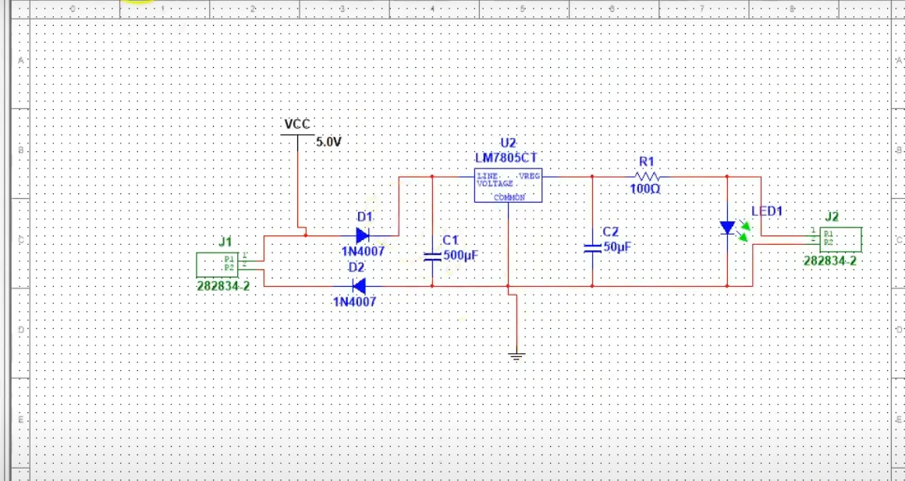
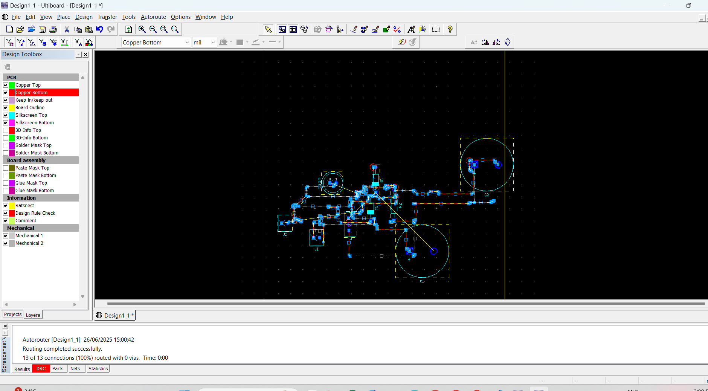
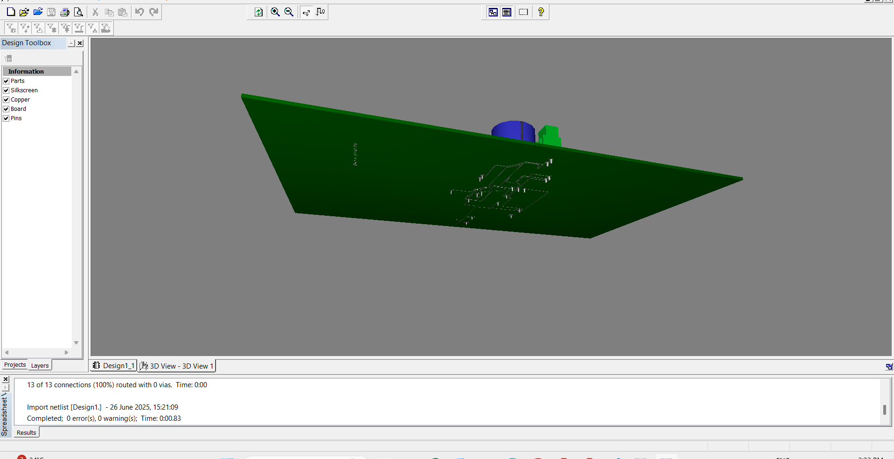

# 5V Regulated Power Supply PCB

This project is a simple regulated 5V DC power supply designed using the **LM7805 voltage regulator**.

## 🔧 Circuit Description
- **Input:** 5V (DC)
- **Rectification:** Diodes 1N4007
- **Regulator:** LM7805
- **Filtering:** 500µF and 50µF Capacitors
- **Output:** 5V DC with status LED

## 📷 Screenshots
### Schematic

### PCB Layout

### 3D View

## 💡 Software Used
- NI Multisim / Ultiboard

## 📁 Files Included
- Schematic image
- PCB layout image
- 3D view image

## 🔌 Applications
- Can be used to power microcontrollers, sensors, and IoT modules with 5V regulated supply.
