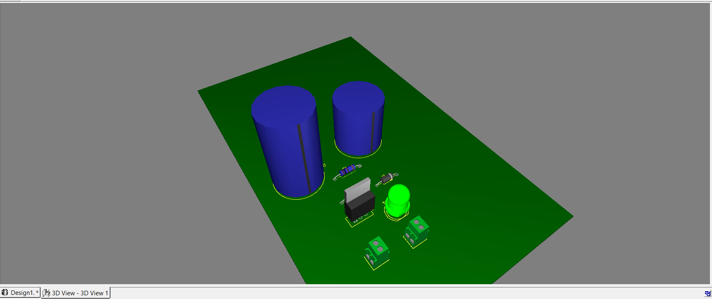

# 🔋 5V Regulated Power Supply - PCB Design

This project is a **regulated 5V DC power supply** designed using the **LM7805 voltage regulator IC**.  
The circuit takes an unregulated DC input and provides a stable 5V output, commonly used to power microcontrollers, sensors, and small electronics.

---

## 🧠 Features

- 📥 Input Voltage: 6V to 15V DC
- 📤 Output Voltage: Regulated 5V DC
- 🔧 Voltage Regulator: LM7805
- 💡 LED Indicator for Output Status
- ⚡ Capacitor filtering for ripple-free supply
- 🖨️ Designed on PCB with 3D view and layout

---

## 🖥️ Software Used

- NI Multisim (for schematic)
- NI Ultiboard (for PCB layout & 3D model)

---

## 🗂️ Files Included

| File Name                  | Description                      |
|---------------------------|----------------------------------|
| `Schematic.png`           | Circuit diagram                  |
| `PCB_Layout.png`          | Main PCB layout view             |
| `PCB_Layout_Alternate.png`| Alternate PCB layout angle       |
| `3D_View.png`             | 3D model side view               |
| `3D_topView.png`          | 3D model top view                |

---

## 📷 Visuals

### 🔌 Schematic  

---

### 📐 PCB Layout (Front)  

---

### 🔁 Alternate PCB Layout View  

---

### 🧱 3D View (Side)  

---

### 📸 3D View (Top)  

---

## 🎯 Applications

- Powering Arduino, NodeMCU, and other microcontrollers
- Mini embedded projects
- Breadboard power supply module
- Portable electronics charging setup

---

## 👨‍🔧 Designed By

**Mohammad Suhel**  
2nd Year Electrical Engineering Student  
[GitHub Profile](https://github.com/your-username)

---

## 📬 Suggestions / Improvements

Feel free to fork, suggest improvements, or open issues.  
Let’s build better circuits together! 🔧✨

